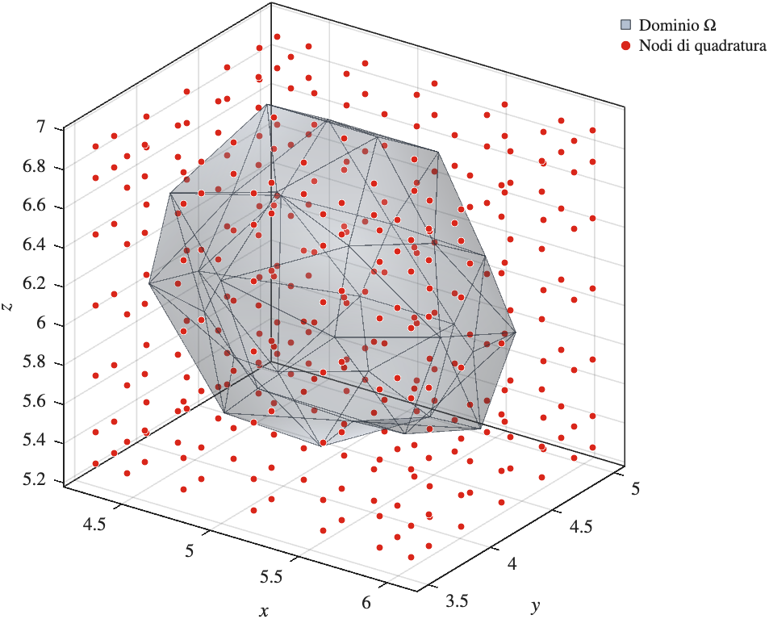
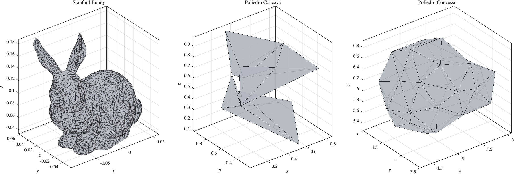

# OptimalPolyCuba3D

<p align="center">
  
</p>

Questa directory contiene le implementazioni del metodo **OptimalPolyCuba3D (OPC3D)**, basato sulla costruzione di regole di cubatura mediante una base tensoriale di polinomi di Chebyshev e sul calcolo dei momenti geometrici del dominio poliedrale tramite il teorema della divergenza applicato alle facce triangolari del bordo.

Il progetto comprende tre implementazioni dello stesso metodo:

- **MATLAB** (`Matlab3D/`): orientata allo sviluppo, alla validazione numerica e alla visualizzazione;
- **Fortran** (`Fortran3D/`): implementazione seriale orientata alle prestazioni;
- **Fortran parallela** (`Parallel3D/`): versione della precedente con parallelizzazione OpenMP.

In tutte le versioni la routine principale si chiama `OPC3D`.

---

## Struttura della directory

```text
Mesh3D/
│
├── README.md
├── assets/
│
├── Matlab3D/
│   ├── examples/
│   │   ├── bun_zipper.ply
│   │   ├── bunny_tri.dat
│   │   ├── bunny_vertex.dat
│   │   ├── concave_tri.dat
│   │   ├── concave_vertex.dat
│   │   ├── convex_tri.dat
│   │   ├── convex_vertex.dat
│   │   ├── example_bunny.m
│   │   ├── example_concave.m
│   │   ├── example_convex.m
│   │   └── example_polynomial.m
│   └── src/
│       ├── Dunavant/
│       │   ├── dunavant_degree.m
│       │   ├── dunavant_order_num.m
│       │   ├── dunavant_rule.m
│       │   ├── dunavant_rule_num.m
│       │   ├── dunavant_suborder.m
│       │   ├── dunavant_suborder_num.m
│       │   ├── dunavant_subrule.m
│       │   ├── i4_modp.m
│       │   ├── i4_wrap.m
│       │   ├── reference_to_physical_t3.m
│       │   └── triangle_area.m
│       ├── OPC3D.m
│       ├── ShiftingTriangleQuadrature.m
│       ├── TriangleQuadrature.m
│       ├── chebpolys.m
│       ├── chebyshev_moments_polyhedron.m
│       ├── cub_gausscheb_tens3D.m
│       ├── cubature_tens_chebyshev_facet_V.m
│       ├── dCHEBVAND.m
│       ├── mono_next_grlex.m
│       ├── scale_rule.m
│       └── tenscheb_norm2sq.m
│
├── Fortran3D/
│   ├── Makefile
│   ├── examples/
│   │   ├── bunny_tri.dat
│   │   ├── bunny_vertex.dat
│   │   ├── concave_tri.dat
│   │   ├── concave_vertex.dat
│   │   ├── convex_tri.dat
│   │   ├── convex_vertex.dat
│   │   ├── example_bunny.f90
│   │   ├── example_concave.f90
│   │   ├── example_convex.f90
│   │   └── example_polynomial.f90
│   └── src/
│       ├── CubatureFunctions.f90
│       ├── OPC3D.f90
│       ├── PolyhedronMesh.f90
│       ├── ReferenceFunctions.f90
│       ├── TriangleQuadratureDunavant.f90
│       ├── TriangleQuadratureGJ.f90
│       └── TypesDef.f90
│
└── Parallel3D/
    ├── Makefile
    ├── examples/
    │   ├── bunny_tri.dat
    │   ├── bunny_vertex.dat
    │   ├── concave_tri.dat
    │   ├── concave_vertex.dat
    │   ├── convex_tri.dat
    │   ├── convex_vertex.dat
    │   ├── example_bunny.f90
    │   ├── example_concave.f90
    │   ├── example_convex.f90
    │   └── example_polynomial.f90
    └── src/
        ├── CubatureFunctions.f90
        ├── OPC3D_Parallel.f90
        ├── PolyhedronMesh.f90
        ├── ReferenceFunctions.f90
        ├── TriangleQuadratureDunavant.f90
        ├── TriangleQuadratureGJ.f90
        └── TypesDef.f90
```

Le tre implementazioni sono organizzate separatamente, ma mantengono la stessa impostazione algoritmica e gli stessi esempi di riferimento. Ogni directory è autonoma: contiene il proprio codice sorgente, gli esempi e i dati geometrici.

### Esempi disponibili

| Esempio | Dominio | Contenuto |
|---------|---------|-----------|
| `example_convex` | Poliedro convesso | Caso di base per la validazione. |
| `example_concave` | Poliedro concavo | Verifica su un dominio non convesso. |
| `example_bunny` | Stanford Bunny | Mesh di grandi dimensioni, test di prestazioni. |
| `example_polynomial` | Poliedro di test | Verifica dell'esattezza su polinomi di grado `<= ade`. |

<p align="center">
  
</p>

---

## Il metodo in breve

Dato il grado polinomiale `ade`, la procedura:

1. costruisce sul cubo di riferimento `[-1,1]^3` una griglia tensoriale di Gauss-Chebyshev con `(ade+1)^3` nodi;
2. costruisce la base tensoriale di Chebyshev di grado totale `<= ade` (ordinamento GRLEX), di dimensione `N_mom = (ade+1)(ade+2)(ade+3)/6`;
3. calcola i momenti della base sul poliedro trasformandoli, con il teorema della divergenza, in integrali sulle facce triangolari della mesh;
4. riscala i nodi sulla bounding box del poliedro e ricombina i momenti per ottenere i pesi.

La regola restituita ha `(ade+1)^3` nodi ed è esatta per polinomi di grado totale fino a `ade` sul poliedro. I pesi possono essere negativi.

### Quadratura sulle facce

Gli integrali sulle facce sono calcolati con una regola di quadratura sul triangolo, scelta tramite il parametro `method`:

| `method` | Regola | Note |
|----------|--------|------|
| `'GJ'`   | Prodotto di Gauss-Jacobi sul triangolo di riferimento | `nGP = ceil((ade+2)/2)` punti per direzione, cioè `nGP^2` punti per faccia. Nessun limite su `ade`. |
| `'D'`    | Regole di Dunavant | Si usa la regola di grado `ade+1`; le regole sono disponibili fino al grado 20, quindi `ade <= 19`. |

Il grado di precisione richiesto sulle facce è `ade+1` (e non `ade`) perché la primitiva usata nel teorema della divergenza aumenta di uno il grado dell'integranda.

---

## Implementazione MATLAB

La funzione principale è:

```text
Matlab3D/OPC3D.m
```

Le funzioni ausiliarie sono in `Matlab3D/src/`, mentre gli esempi e i dati geometrici sono in `Matlab3D/examples/`.

### Interfaccia

```matlab
[XYZ, W] = OPC3D(ade, vertices, facets, method)
```

dove:

- `ade` è il grado polinomiale totale massimo considerato nella procedura di matching dei momenti;
- `vertices` è una matrice `N x 3` con le coordinate cartesiane dei vertici della mesh;
- `facets` è una matrice `M x 3` con la connettività delle facce triangolari;
- `method` seleziona la quadratura sulle facce (`'GJ'` o `'D'`).

La funzione restituisce:

- `XYZ`, matrice `(ade+1)^3 x 3` con le coordinate dei nodi di cubatura;
- `W`, vettore con i relativi pesi.

La funzione integranda può essere valutata dopo la costruzione della regola:

```matlab
I = W' * f(XYZ(:,1), XYZ(:,2), XYZ(:,3));
```

La separazione tra costruzione della regola e valutazione dell'integranda permette di riutilizzare la stessa regola per funzioni diverse.

### Funzioni ausiliarie (`src/`)

| File | Contenuto |
|------|-----------|
| `cub_gausscheb_tens3D.m` | Griglia tensoriale di Gauss-Chebyshev sul cubo di riferimento. |
| `mono_next_grlex.m` | Generazione degli indici in ordinamento GRLEX. |
| `chebpolys.m` | Valutazione dei polinomi di Chebyshev. |
| `dCHEBVAND.m` | Matrice di Vandermonde-Chebyshev tridimensionale. |
| `tenscheb_norm2sq.m` | Norme quadrate della base tensoriale di Chebyshev. |
| `chebyshev_moments_polyhedron.m` | Momenti di Chebyshev sul poliedro. |
| `cubature_tens_chebyshev_facet_V.m` | Contributo di una singola faccia ai momenti. |
| `TriangleQuadrature.m` | Regola di quadratura sul triangolo (Gauss-Jacobi). |
| `ShiftingTriangleQuadrature.m` | Traslazione della regola sul triangolo di riferimento alle facce della mesh. |
| `scale_rule.m` | Riscalamento dei nodi sulla bounding box del poliedro. |
| `Dunavant/` | Regole di Dunavant e relative routine di supporto (`dunavant_rule`, `dunavant_degree`, `triangle_area`, `reference_to_physical_t3`, ...). |

### Esecuzione degli esempi

Dalla directory `Matlab3D/examples/` (aggiungendo `../` e `../src/` al path, se non già fatto dallo script):

```matlab
example_convex
example_concave
example_polynomial
example_bunny
```

`example_bunny.m` può leggere sia i file `bunny_vertex.dat` / `bunny_tri.dat` sia la mesh originale `bun_zipper.ply`.

---

## Implementazione Fortran

La routine principale è implementata nel modulo `OPC3D_Module`, nel file:

```text
Fortran3D/src/OPC3D.f90
```

e si utilizza con:

```fortran
USE OPC3D_Module, ONLY: OPC3D

CALL OPC3D(ade, vertices, facets, method, XYZ, W)
```

dove:

| Argomento  | Tipo | Descrizione |
|------------|------|-------------|
| `ade`      | `INTEGER, INTENT(IN)` | Grado polinomiale totale massimo. |
| `vertices` | `REAL(dp), INTENT(IN)`, `(:,:)` | Coordinate dei vertici, `N x 3`. |
| `facets`   | `INTEGER, INTENT(IN)`, `(:,:)` | Connettività delle facce, `M x 3`, con indici che partono da 1. |
| `method`   | `CHARACTER(LEN=*), INTENT(IN)` | `'GJ'` oppure `'D'`. |
| `XYZ`      | `REAL(dp), ALLOCATABLE, INTENT(OUT)`, `(:,:)` | Nodi di cubatura, `(ade+1)^3 x 3`. |
| `W`        | `REAL(dp), ALLOCATABLE, INTENT(OUT)`, `(:)` | Pesi di cubatura. |

Le variabili reali usano il tipo `REAL(dp)` (doppia precisione) definito in `TypesDef.f90`.

La funzione integranda non viene passata a `OPC3D`. Come nella versione MATLAB, può essere valutata successivamente sui punti di cubatura:

```fortran
Integrale = 0.0_dp
DO i = 1, SIZE(W)
    Integrale = Integrale + W(i) * f(XYZ(i,1), XYZ(i,2), XYZ(i,3))
END DO
```

### Moduli

| File | Contenuto |
|------|-----------|
| `TypesDef.f90` | Precisione `dp` e costanti. |
| `PolyhedronMesh.f90` | Tipo `t_polyhedron` e lettura delle mesh (`MeshReader`). |
| `ReferenceFunctions.f90` | Griglia di Gauss-Chebyshev, ordinamento GRLEX, matrice di Vandermonde-Chebyshev, norme della base. |
| `TriangleQuadratureGJ.f90` | Quadratura di Gauss-Jacobi sul triangolo. |
| `TriangleQuadratureDunavant.f90` | Regole di Dunavant sul triangolo. |
| `CubatureFunctions.f90` | Momenti di Chebyshev sul poliedro e sulle singole facce, riscalamento della regola. |
| `OPC3D.f90` | Routine principale `OPC3D`. |

### Compilazione

La compilazione è gestita dal `Makefile` presente in `Fortran3D/`. Il compilatore è `gfortran`.

Gli oggetti compilati vengono collocati in `build/`, i moduli `.mod` in `modules_build/`; entrambe le directory sono create automaticamente.

Per compilare tutti gli esempi:

```bash
make
```

oppure:

```bash
make examples
```

Vengono generati gli eseguibili:

```text
example_convex
example_concave
example_polynomial
example_bunny
```

Ciascun esempio può essere compilato ed eseguito direttamente con il relativo target:

```bash
make convex
make concave
make polynomial
make bunny
```

Gli esempi vengono eseguiti dalla directory `examples/`, in modo che i file `.dat` possano essere caricati direttamente.

Per scegliere il metodo di quadratura, modificare la chiamata a `OPC3D` nell'esempio (`'GJ'` oppure `'D'`).

### Pulizia e informazioni

Per rimuovere oggetti, moduli compilati ed eseguibili:

```bash
make clean
```

Per una pulizia completa:

```bash
make distclean
```

Per visualizzare le principali informazioni sulla configurazione del progetto:

```bash
make info
```

---

## Implementazione Fortran parallela (OpenMP)

La directory `Parallel3D/` contiene la versione del codice Fortran con parallelizzazione **OpenMP**. La routine principale si trova in:

```text
Parallel3D/src/OPC3D_Parallel.f90
```

Gli altri moduli (`CubatureFunctions.f90`, `PolyhedronMesh.f90`, `ReferenceFunctions.f90`, `TriangleQuadratureGJ.f90`, `TriangleQuadratureDunavant.f90`, `TypesDef.f90`), gli esempi e i dati geometrici hanno la stessa struttura di `Fortran3D/`. L'interfaccia di `OPC3D` è identica a quella seriale.

### Compilazione ed esecuzione

La compilazione avviene tramite il `Makefile` presente in `Parallel3D/`, con gli stessi target della versione seriale (`make convex`, `make concave`, `make polynomial`, `make bunny`, `make clean`, `make distclean`, `make info`).

Il numero di thread si controlla con la variabile d'ambiente `OMP_NUM_THREADS`:

```bash
export OMP_NUM_THREADS=4
make bunny
```
---

## Autore

Edoardo Longo, Università degli Studi di Verona.

## Riferimenti

Per la formulazione matematica del metodo, la costruzione dei momenti, la costruzione delle regole di cubatura e i risultati numerici si rimanda alla documentazione scientifica e alla tesi associate al progetto **OptimalPolyCuba3D**.
